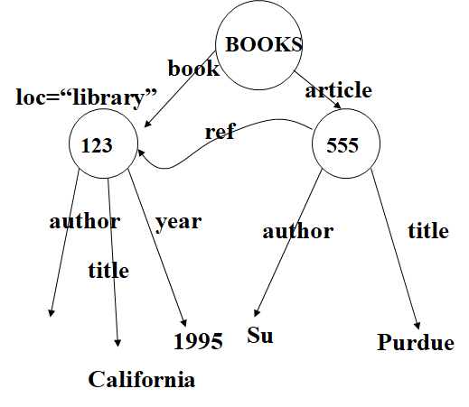
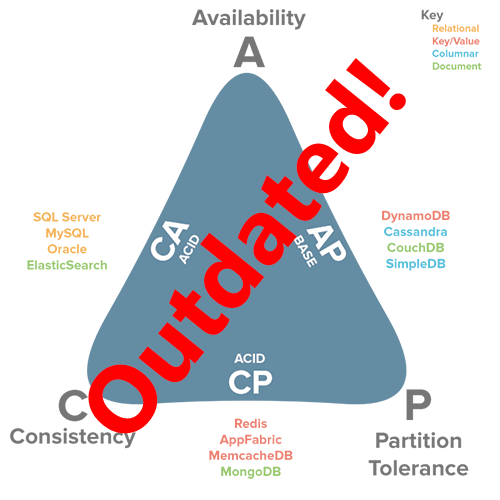
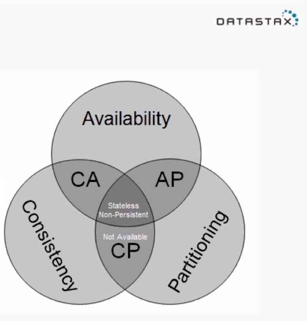
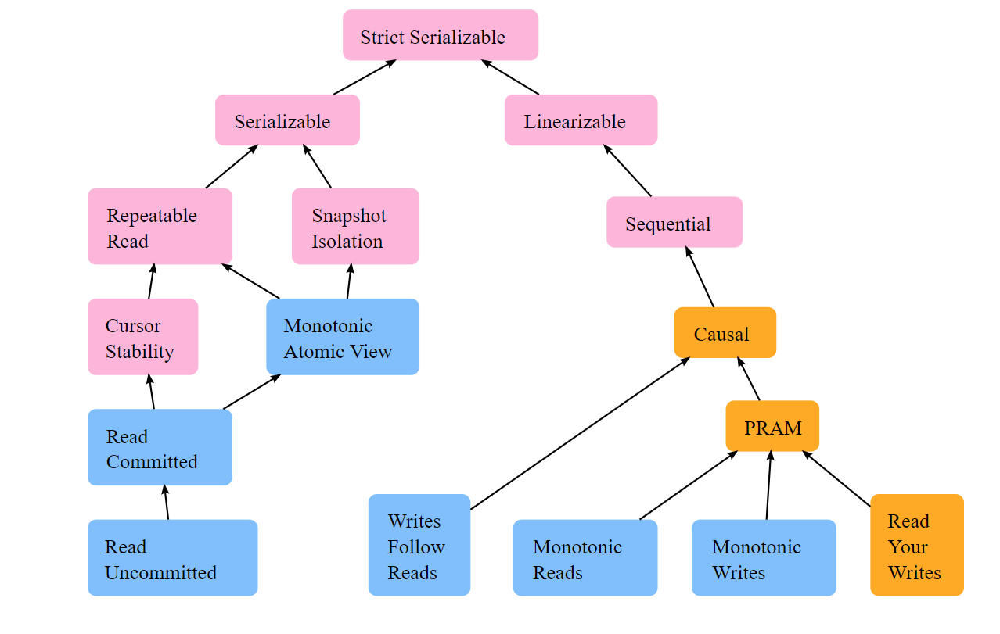
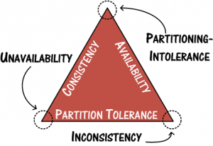

## Data Structure ,Databases and Einstein

By Sachin Dixit

## What is Data ?

image credit due
## Data Structures 

- Why would we differentiate between primitives vs DSs ?  
- Famous DSs   
  -   Array : 1D,2D,3D so on …  
  -   Stack :   
  -   Sets :  
  -   Maps  
  -   Queue : Simple , circular , priority   
  -   List :SLL,DLL,SCLL,DCLL   
  -   Tree: bTree ,  
  -   Graph :directed , undirected,simple,weighted,connected   
- Tables ? RDDs ? dataframe ?   
- Advanced DS we don't talk about   
- Is Date a DS ? why ? whynot ?  

## Taking a grip on DS

- What gives rise to O notation?  
- Benefits vs limitations   
    - time vs. space  
    - performance vs. elegance  
    - generality vs. simplicity  
    - one operation’s performance vs. another’s  
- Choices made by language runtime !  
- The cast system :D   
- Type system ? what about them ?  
- Objects ? don't get me started …. :P   
  

## What about “other than text”

- Images  
- Voice   
- Vidoes   
- Geospatial    
- Many more  
- What do we mean by unstructured data ?   
- Are these DS ?  
- Skipping data storage formats : perquet ,ORC ,avro ,protobuff .Also yaml  

## Data Transfer 

- Tab vs common vs pipe vs something separated : Loose and easy  
- XML is great ? why ?  
- JSOn is great ? why ?  
- Is schema necessary ? where and how it will impact ?   
- The Document model inspiration of the www !  
  
- Aside : Namespacing and RSS/SOAP/ATOM  
  
  
  
What happens to your DS in these transfer formats ?

## Xml  intuition 

<BOOKS>  
<book id=“123” loc=“library”>  
   <author>Hull</author>  
   <title>California</title>  
   <year> 1995 </year>  
</book>  
<article id=“555” ref=“123”>  
   <author>Su</author>  
   <title> Purdue</title>  
</article>  
</BOOKS>  
Credit :https://goldberg.berkeley.edu/courses/F04/215/XML-215-presentation.ppt  

## JSON

- JSON is not a document format.  
- JSON is not a markup language.  
- JSON is not a general serialization format.  
 - No cyclical/recurring structures.  
 - No invisible structures.  
 - No functions  
- JSON has no validator  (!?)
_Credit : Crockford _

- JSON's simple values are the same as used in programming languages.  
- No restructuring is required: JSON's structures look like conventional programming language structures.  
- JSON's object is record, struct, object, dictionary, hash, associate array...  
- JSON's array is array, vector, sequence, list…  
Language independent data interchange  

## JSON is not XML

- objects  
- arrays  
- strings  
- numbers  
- booleans  
- null  
  
_Credit : Crockford 
_

- element  
- attribute  
- attribute string  
- content  
- <![CDATA[ ]]>  
- entities  
- declarations  
- schema  
- stylesheets  
- comments  
- version  
- namespace

## Data meet the DataBase 

- What happens to your DS in database ?  
- Issues of fitment and loss of detail   
- Internal DS used by db (for  academic interest )  
- Different DB/Storage types ?

## Database types or Data organization styles ?

- RDBMS : oracle,mysql,postgres  
- Key Value stores : Redis ,Memcache  
- Document Store :MongoDB, DynamoDB   
- Wide Column : Hbase , Cassandra   
- Graph DB : Neo4j  
- General features for NOSql family   
    - Semi structured data   
    - Non relational flexible schema    
    - Looser transaction guarantees   
- What about CMS ?  
- What about big data ?  
- Problems of scale for DBs: a CAP for you 

## NSQL Intuition 

RDBMS vs NoSQL
| Data Model     | relations tuples   attributes  domains normalization | documents graphs key/values                  |
| Query Model    | relational algebra tuple calculus                    | graph traversal text search map/reduce       |
| Implementation | rigid schemas ACID compliance                        | flexible schemas BASE                        |

Image source :kdnuggets  

## Slide 13

CAP Theorem 

Consistency - A read is guaranteed to return the most recent write for a given client.  
Availability - A non-failing node will return a reasonable response within a reasonable amount of time (no error or timeout).  
Partition Tolerance - The system will continue to function when network partitions occur.  
creditsrobertgreinerhttps://robertgreiner.com/cap-theorem-revisited  

## Slide 14

CAP vs BASE

Must read on BASE  
Brewer : https://ieeexplore.ieee.org/document/6133253 or https://www.infoq.com/articles/cap-twelve-years-later-how-the-rules-have-changed/   
Coda hale : https://codahale.com/you-cant-sacrifice-partition-tolerance/  
Klepmenn : https://martin.kleppmann.com/2015/05/11/please-stop-calling-databases-cp-or-ap.html    
Greiner : https://robertgreiner.com/cap-theorem-revisited    

## Slide 15

Different Definition 

A as in CAP ie A with network partition of Data vs 9’s “a” implied by cloud vendors   
C as in CAP vs C as in ACID vs C as in DB engine consistency models   
  
Image : https://jepsen.io/consistency   
Read more : https://www.alexdebrie.com/posts/database-consistency/   
https://www.alexdebrie.com/posts/when-does-cap-theorem-apply/ 

## Slide 16

Aviability 

Server availability vs Data availability ( as in CAP theorem)  
Data availability wins over consistency .Partition tolerance no more a choice  
Replication in DB:  
Master Slave replication   
Master Master replication ( conflicts ,load balancing ,extra resources )  
Sharding : Data partitioning on some basis in separate servers /nodes .Adds to complexity   
Denormalization :Duplicate less critical data for read performance . Now called NoSQL   
Cache : Benefit from local copy for slow chanings data , leads to refresh/staleness problems  
  DB Cache : Queries ,Rows ,Frequent data  
Sync/Real Time vs Async storage   
Queueing within Dbs (hidden from us )

## Slide 17

Consistency 

Every read receives the most recent write or an error  
Weak Consistency : typical network based services eg phone calls ,video cals , cable tv   
Eventual Consistency : Think facebook updates   
BASE Theorem  
Basically available - the system guarantees availability.  
Soft state - the state of the system may change over time, even without input.  
Eventual consistency - the system will become consistent over a period of time,   
2 phase commit   
Strong Consistency : ACID as in RDBMS   
Problem of consensus and leader election: PAXOS ,RAft  
Fault Tolerance : Byzantine   
Task Distribution : Zookeeper and Yarn  
Computational consistency : Time clocks   
Read https://cloud.google.com/spanner/docs/true-time-external-consistency  

## Slide 18

Partition Tolerance 

The system continues to operate despite network partitions  
Coda Hale, Yammer software engineer:  
“Of the CAP theorem’s Consistency, Availability, and Partition Tolerance, Partition Tolerance is mandatory in distributed systems. You cannot not choose it.”  
Different data may require different consistency and availability  
keep related data close together to assure better performance  
No partition ⇒ Latency or consistency loss 

## Slide 19

DataModelling 

RDBMS   
https://www.seas.upenn.edu/~zives/03f/cis550/codd.pdf   
Cassandra   
https://www.oreilly.com/content/cassandra-data-modeling/   
https://tech.ebayinc.com/engineering/cassandra-data-modeling-best-practices-part-1/  
Mongo db :  
https://docs.mongodb.com/manual/data-modeling/  
Overall : This one has lots of sublinks   
https://www.kdnuggets.com/2016/07/seven-steps-understanding-nosql-databases.html  
Credit : stack exchange

## Slide 20

Usage Scenario:Cassandra 

Distributed data {enough partition key}{sparse-wide column}  
Scale linearly (peer to peer gossip,It AP of CAP)  
Restricted by keys (no query by columns like RDBMS,sec index are for optimizations and not to be confused for where clause facility )  
No ACID , locks ,transactions   
No Joins-groupby please ( data Model can take care of it in some part)  
Write oriented (for a reason !,time sensitivity )  
Updates are rare (and are idempotent )  
Lifetime is key feature   
Faster reads for primary keys ( remember OLAP-DW )(keys are the gist)(columnar storage )  
Counters (but not that imp )  
Replicated to 3 nodes , triple (R,W,N from dynamo paper . Vector clocks .  
Hence : Logging ,time series data ,tracking data,Telemetry    

## Slide 21

Usage Scenario:MongoDB 

Document (json like ) nature   
Few relations in data hence no joins !   
key based search that are faster   
Aggregated views concept-embedded data models    
liberal with data duplication but focused on ref keys ( 1-1 ,1-many etc )  
Retrieval is schema free so less queries are direct and hence fast to process  
Almost ACID ,via 4.0 transactional guarantees apply  
Rapid changes in table ie collection structure ,flexible schema ,TTL =yes   
Index yes ,but don't rely on too many secondary index   
Sharding(shard key), replica set   (primary-write and secondary-read)  
Ootb aggregation (map-reduce,distinct )  
Larger variery of index (_id,geospatial,multikey,hased,ttl )  
Raft like , leader election   
Full text search 

## Slide 22

Meet Einstein  

Mutable or not ?  
What is state ?  
Time sensitivity !  
Batch vs Streaming   
Eventtime vs process time vs windowing  
AWS style data centers  

React : https://medium.com/better-programming/react-state-of-the-state-e30e98abdb01,  
microsevics :https://garysmicroservices.wordpress.com/2016/01/06/event-logs-state-flows-microservices-how-do-these-relate/ 

## Slide 23

Further Viewing 

https://www.youtube.com/watch?v=Y6Ev8GIlbxc   
https://www.youtube.com/watch?v=tpspO9K28PM   
https://www.youtube.com/watch?v=d7nAGI_NZPk   
https://www.youtube.com/watch?v=LAqyTyNUYSY   
http://thesecretlivesofdata.com/raft/   
http://harry.me/blog/2014/12/27/neat-algorithms-paxos/ or https://lamport.azurewebsites.net/pubs/paxos-simple.pdf    
https://www.youtube.com/watch?v=q3ja_07MFr8   
http://www.scs.stanford.edu/17au-cs244b  
https://pdos.csail.mit.edu/6.824/schedule.html/  

 https://www.youtube.com/watch?v=F6I5zquEUsw  https://www.youtube.com/watch?v=6bWBEJBMNG0  
https://www.oreilly.com/radar/the-world-beyond-batch-streaming-102/    
Brewer : https://ieeexplore.ieee.org/document/6133253 or https://www.infoq.com/articles/cap-twelve-years-later-how-the-rules-have-changed/  
Greiner : https://robertgreiner.com/cap-theorem-revisited/    
Coda hale : https://codahale.com/you-cant-sacrifice-partition-tolerance/  
Klepmenn : https://martin.kleppmann.com/2015/05/11/please-stop-calling-databases-cp-or-ap.html    
Debrie :  https://www.alexdebrie.com/posts/database-consistency/ https://www.alexdebrie.com/posts/when-does-cap-theorem-apply/   

## Slide 24

Further reading

https://en.wikipedia.org/wiki/Multiversion_concurrency_control  
https://medium.com/@rakyll/things-i-wished-more-developers-knew-about-databases-2d0178464f78   
https://www.techempower.com/benchmarks/#section=data-r19&hw=ph&test=json   
https://eng.uber.com/postgres-to-mysql-migration    
https://guides.library.oregonstate.edu/research-data-services/data-management-types-formats   
https://www.w3schools.com/xml/  https://www.json.org/json-en.html   
https://db-engines.com/en/ranking_categories   
https://www.kdnuggets.com/2016/07/seven-steps-understanding-nosql-databases.html   
https://robertgreiner.com/cap-theorem-revisited/  
https://web.mit.edu/6.005/www/fa15/classes/09-immutability/   
  

